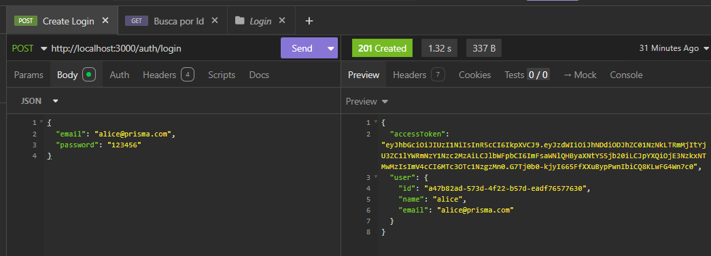
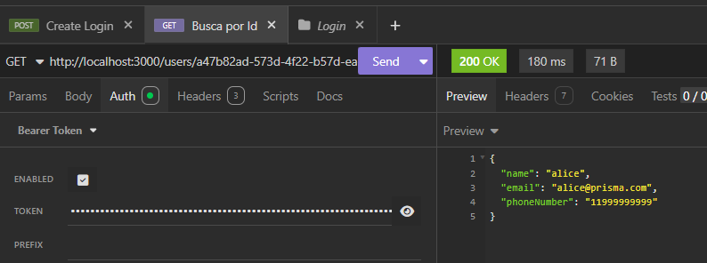

# Summary
Implements JWT authentication, protecting private routes and returning an access token on login.
 
## Changes
- Configured `JwtModule` with `registerAsync` and `ConfigService` to load `JWT_SECRET`
- Implemented `JwtStrategy` for token validation
- Implemented `JwtAuthGuard` to protect private routes
- Exported `JwtAuthGuard` from `AuthModule`
- Imported `AuthModule` in `UsersModule`
- Set `POST /users` as a public route
- Added `isPrismaError` helper in `UsersController` to handle unknown error types
- Added `ConflictException` handling for duplicate CPF/email on user creation
- Installed `@nestjs/jwt`, `@nestjs/passport`, `passport`, `passport-jwt` and `@types/passport-jwt`
 
## Why this approach? / Justification
`JwtModule.registerAsync` was used instead of `JwtModule.register` to ensure the `JWT_SECRET` environment variable is fully loaded via `ConfigService` before the module initializes, preventing `secretOrPrivateKey must have a value` errors at runtime.
 

## Screenshots (if applicable)

 
## Refs
ID: 86agqf8a1
